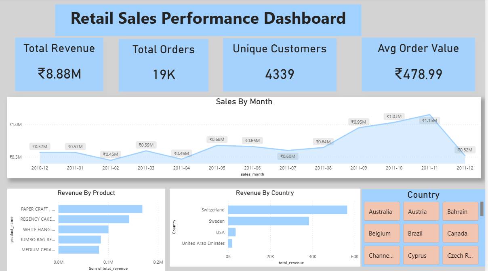

# Retail Sales Data Pipeline & Analytics Dashboard

## 📌 Project Overview

This project demonstrates an **end-to-end data pipeline** built using Python, SQL, and Power BI.
The goal is to ingest raw retail transaction data, clean and transform it, and generate actionable insights through an interactive dashboard.

The dataset consists of **500,000+ retail transactions**, simulating real-world data challenges such as missing values, duplicates, and inconsistent records.

---

## 🏗️ Pipeline Architecture

```
Excel Dataset
     ↓
Python (Data Ingestion)
     ↓
MySQL (Bronze Layer - raw_retail)
     ↓
SQL Cleaning & Transformation (Silver Layer - clean_retail)
     ↓
Gold Tables (Aggregated Analytics)
     ↓
Power BI Dashboard
```

---

## 🛠️ Tech Stack

* **Python** (Pandas, mysql-connector)
* **MySQL**
* **SQL** (CTEs, Window Functions)
* **Power BI**
* **Git & GitHub**

---

## 📂 Project Structure

```
retail-sales-project
│
├── data
│   └── Online Retail.xlsx
│
├── python
│   └── data_ingestion.py
│
├── sql
│   ├── data_cleaning.sql
│   └── analysis_queries.sql
│
├── dashboard
│   ├── retail_sales_dashboard.pbix
│   └── dashboard_preview.png
│
└── README.md
```

---

## 🔄 Data Pipeline Steps

### 1. Data Ingestion (Python)

* Loaded Excel dataset using Pandas
* Inserted data into MySQL database
* Handled missing values and data type conversions

---

### 2. Data Profiling

* Identified key data issues:

  * Cancelled invoices (`InvoiceNo LIKE 'C%'`)
  * Negative quantities (returns)
  * Missing Customer IDs
  * Duplicate records

---

### 3. Data Cleaning (SQL)

* Removed cancelled transactions
* Filtered negative quantities
* Removed null Customer IDs
* Eliminated duplicates using **CTEs + ROW_NUMBER()**
* Created derived column:

```
Revenue = Quantity × UnitPrice
```

---

### 4. Data Modeling (Bronze–Silver–Gold)

* **Bronze Layer:** Raw data (`raw_retail`)
* **Silver Layer:** Cleaned dataset (`clean_retail`)
* **Gold Layer:** Aggregated analytics tables:

  * Monthly sales summary
  * Product performance
  * Customer metrics

---

### 5. Data Analysis

Key analyses performed:

* Revenue trends over time
* Top-performing products
* Country-level revenue distribution
* Customer spending patterns

---

## 📊 Power BI Dashboard

The dashboard provides an interactive view of retail performance.

### Key Features:

* **KPI Metrics**

  * Total Revenue
  * Total Orders
  * Unique Customers
  * Average Order Value

* **Visualizations**

  * Monthly Revenue Trend
  * Top 10 Products by Revenue
  * Revenue by Country (excluding UK)
  * Customer Spend Distribution
  * Average Order Value Trend

---

## 📸 Dashboard Preview



---

## 💡 Key Insights

* The majority of revenue is generated from the UK, indicating strong domestic market concentration.
* A small percentage of customers contribute a large share of revenue.
* Certain products dominate overall sales performance.
* International markets show growth potential when UK is excluded.

---

## 🚀 Future Improvements

* Automate the pipeline using scheduling (cron / task scheduler)
* Integrate cloud storage (AWS S3 / Azure / GCP)
* Use distributed processing tools (Apache Spark)
* Implement workflow orchestration (Apache Airflow)

---

## 🧠 Learnings

* Built a complete **data pipeline from ingestion to visualization**
* Gained hands-on experience with **SQL transformations and window functions**
* Learned how to handle **real-world messy datasets**
* Improved ability to **translate data into business insights**

